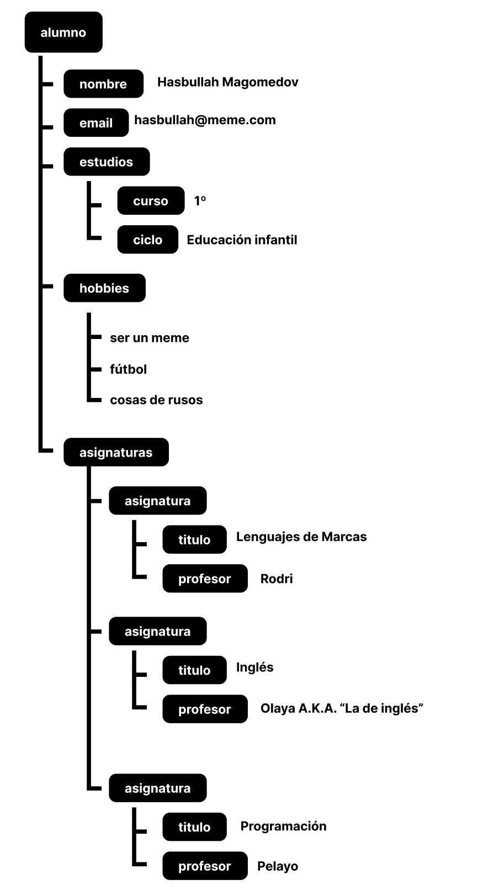
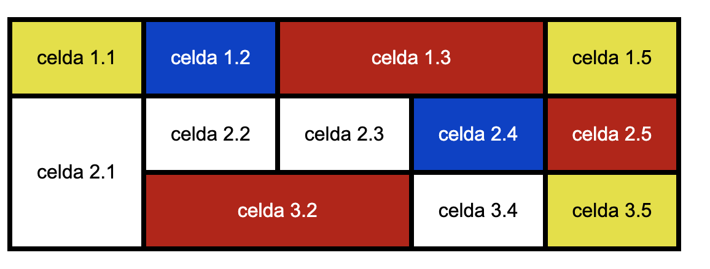
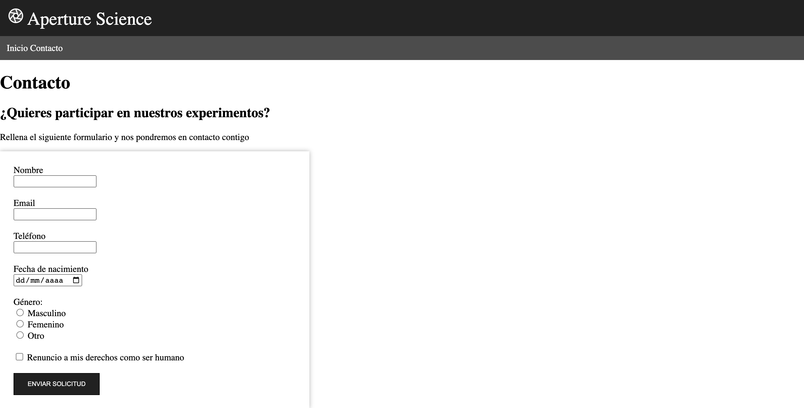
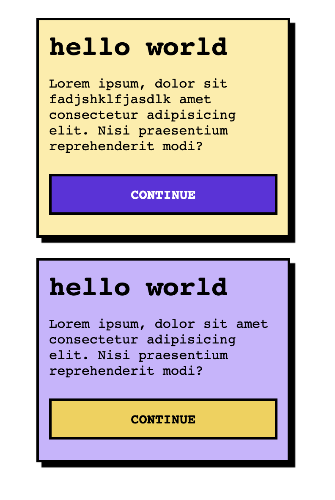

# Lenguajes de marcas y sistemas de gestión de la información - 1ª Evaluación

Examen práctico de la primera evaluación de Lenguajes de marcas y sistemas de gestión de la información

## Contenidos:

- Tema 1: XML y JSON
- Tema 2: HTML
- Tema 3: CSS

## Enunciado

Partiendo del siguiente repositorio `https://github.com/rodri-afa/LLMM-22_23-1Ev`, realizar los siguientes 4 ejercicios en sus correspondientes carpetas.

`⚠️ No modificar la estructura de archivos proporcionada en el repositorio`

### Ejercicio 1 (2pt): XML y JSON

Partiendo de la imagen `1_conversion.png`, expresar dicha estructura tanto en formato XML como en JSON.

- 1_conversion.xml (1pt)
- 1_conversion.json (1pt)



### Ejercicio 2 (3pt): Tablas

Partiendo de los archivos `2_tabla.html` y `2_tabla.css`, recrear en HTML y CSS la tabla contenida en la imagen `2_tabla.png`. Es necesario utilizar **el CSS como un fichero externo** y vincularlo correctamente en el HTML. Utilizar el **inspector web** para ir comprobando que todos los cambios se van aplicando. El **borde tanto de las tablas** como de cada una de las **celdas**, tendrá que ser de **2px** y se aplicará en el **CSS** y no en el HTML. En el fichero del HTML aplicar los siguientes atributos a la tabla:

```html
<table border="0" cellspacing="0" cellpadding="20">
  ...
</table>
```

- 2_tabla.html (1,5pt)
- 2_tabla.css (1,5pt)

La tabla a realizar es la siguiente:



### Ejercicio 3 (3pt): Página web

Realizar 2 páginas HTML, una de inicio `3_index.html` y otra con un formulario de contacto `3_contact.html`, tal y como se indican en las imágenes adjuntas. Dar estilo a ambas con la misma hoja de estilos `3_style.css`.

Los textos e imágenes necesarios para realizar la página se encuentran en la carpeta "recursos". **No mover los contenidos de la carpeta recursos y _hacer referencia de forma RELATIVA_**.

`⚠️ Es preferible que esté la estructura HTML pero que no se parezca a la de la imagen a que no esté. Si ves que el CSS no te sale, no pierdas el tiempo y sigue con el HTML o con otro ejercicio`

Los contenidos de cada fichero son los siguientes:

- **3_index.html (1pt):**

  - Header, con dos apartados:
    - Datos de empresa con el logo, nombre de la empresa (con etiqueta span)
    - Menú de navegación, con enlaces para ir a index y contact
  - Imagen `instalaciones.jpg`
  - Título principal "Bienvenido a Aperture Science"
  - Varios subtítulos (instalaciones, invenciones y personal)
  - Varios párrafos
  - Lista numerada con las invenciones. Cada elemento de la lista tiene que contener también un enlace para ampliar información
  - Lista no numerada con el personal.

- **3_contact.html (1pt):**

  - Header, con dos apartados:
    - Datos de empresa con el logo, nombre de la empresa (con etiqueta span)
    - Menú de navegación, con enlaces para ir a index y contact
  - Formulario con campos para el nombre, email, teléfono, fecha de nacimiento, género (masculino, femenino, otro), aceptar condiciones (si/no).

- **3_style.css (1pt):** utilizar la misma hoja de estilos para las dos páginas HTML. Se valorará el correcto uso de las clases, ids y demás selectores.




### Ejercicio 4 (2pt): Selectores CSS

Sin modificar el HTML (no añadir ni clases ni ids extra), completar la etiqueta style con los selectores que se solicitan. Para comprobar que todo se ha realizado correctamente, se adjunta una imagen de cómo se vería la página si todos los selectores son correctos:


